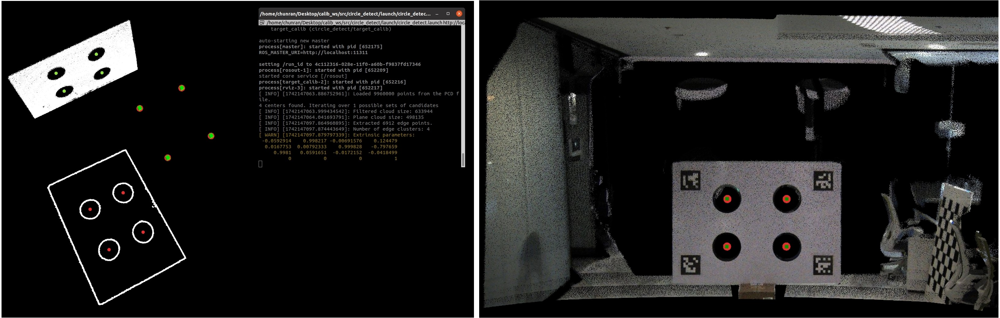
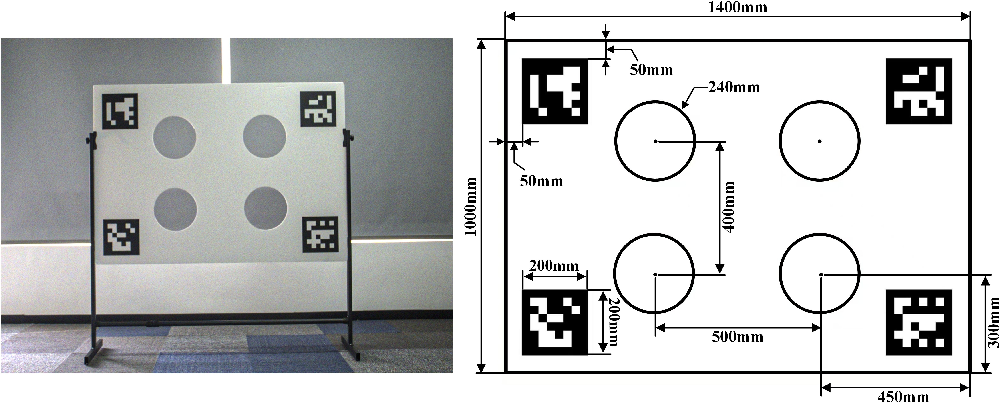

# FAST-Calib MID360 + Hikvision 标定归档

这个仓库是本机 `/home/vision/FAST-Calib` 的 ROS2 FAST-Calib 工作区归档，已经包含：

- MID360 + Hikvision 相机的 ROS2 部署脚本；
- 本次最终成功的采集数据和外参结果；
- 可视化交互式标定流程：采集 -> 静态点云 -> RViz2 拖动四个孔位球 -> 保存球心 -> 出外参；
- 标定过程中遇到的问题、设备配置和复现记录。

完整记录见：

```text
calibration_record/
```

关键文档：

- `calibration_record/quick_start.md`：下次重新标定的最短流程。
- `calibration_record/interactive_workflow.md`：RViz2 拖球交互式标定流程。
- `calibration_record/device_config.md`：设备、网络、相机、雷达、标定板参数。
- `calibration_record/pitfalls_and_solutions.md`：踩坑记录和解决方案。
- `calibration_record/final_result_20260617.md`：本次最终外参结果。

## 本次最终结果

最终外参文件：

```text
output/final_success_20260617/calib_result.txt
```

最终采集数据：

```text
calib_data/final_success_20260617/
```

本次四孔配准 RMSE：

```text
0.004935 m
```

外参：

```yaml
Rcl: [  0.006071,  -0.999079,   0.042474,
        0.013104,  -0.042391,  -0.999015,
        0.999896,   0.006622,   0.012835]
Pcl: [  0.022384,  -0.085765,   0.002566]
```

本次结果是基于 RViz/静态点云中人工确认的四个 LiDAR 孔位计算的，孔位文件为：

```text
output/final_success_20260617/manual_lidar_holes.yaml
```

## 推荐标定流程：RViz2 可视化拖球

准备环境：

```bash
cd /home/vision/FAST-Calib
source /opt/ros/humble/setup.bash
source /home/vision/moving_scaning_hku/ros2_livox_ws/install/setup.bash
source install/setup.bash
```

启动一键交互式流程：

```bash
scripts/interactive_calibration_workflow.sh <scene_name> 25
```

脚本会：

1. 抓取 Hikvision 图像；
2. 录制 MID360 `/livox/lidar` 点云 bag；
3. 运行 FAST-Calib 生成累计静态点云 `filtered_cloud.ply`；
4. 自动生成 RViz 配置；
5. 打开 RViz2 显示完整静态点云和四个可拖动球；
6. 用户将四个球拖到标定板四个孔；
7. 保存球心 YAML；
8. 使用这四个 LiDAR 孔位和相机检测结果输出外参。

RViz 里拖完球后，另开终端保存：

```bash
cd /home/vision/FAST-Calib
source /opt/ros/humble/setup.bash
ros2 service call /save_lidar_hole_markers std_srvs/srv/Trigger {}
```

然后回到流程脚本终端按 Enter，脚本会继续出外参。

## 重新编译

```bash
cd /home/vision/FAST-Calib
source /opt/ros/humble/setup.bash
colcon build --packages-select fast_calib --cmake-args -DCMAKE_BUILD_TYPE=Release
source install/setup.bash
```

如果遇到 PCL/libusb 运行时错误：

```text
undefined symbol: libusb_set_option
```

需要过滤 Hikvision MVS SDK 的旧 libusb：

```bash
CLEAN_LD=$(printf '%s' "${LD_LIBRARY_PATH:-}" | tr ':' '\n' | grep -v '^/opt/MVS/lib' | paste -sd:)
env LD_LIBRARY_PATH="$CLEAN_LD" ros2 run fast_calib manual_lidar_centers_calib ...
```

## 设备配置摘要

- ROS：Humble
- LiDAR：Livox MID360
- LiDAR topic：`/livox/lidar`
- Topic type：`sensor_msgs/msg/PointCloud2`
- MID360 IP：`192.168.1.30`
- 主机 Livox 有线侧 IP：`192.168.1.50`
- 相机：Hikvision，序列号 `DA3217436`
- 标定板 ArUco dictionary：`DICT_4X4_50`
- ArUco IDs：`[0, 1, 3, 2]`
- 四孔间距：`0.500 m x 0.400 m`
- 孔半径：`0.120 m`

注意：不要把 MID360 改回 `192.168.1.3`，该地址会和本机 Wi-Fi/RDP 冲突。

---

# FAST-Calib ROS2 版本

在 [engine1wu](https://github.com/hku-mars/FAST-Calib/issues/35) 的基础上将 ROS1 的 FAST-Calib 项目转换成了 ROS2。仅在 ubuntu 22.04 humble 上进行了测试。
## 运行说明
### 参数配置
在`calib_data/mid360_11`中提供了测试数据，是将[sample data](https://connecthkuhk-my.sharepoint.com/:f:/g/personal/zhengcr_connect_hku_hk/Eq_k_4Mf_11Eggg4a5lbRzgBHwd0EivtCJd2ExtcNlu1FA?e=vjm4gH)中的`mid360/11`点云裁剪后转成了ros2格式。只需要修改 `config/qr_params.yaml` 文件中的路径相关的参数就可以跑这组测试数据了，其中`bag_path`是*ros2 bag PointCloud2*的文件夹。
### 启动节点
```bash
ros2 launch fast_calib calib.launch.py
```


# FAST-Calib
FAST-Calib is an automatic target-based extrinsic calibration tool for LiDAR-camera systems (eg., [FAST-LIVO2](https://github.com/hku-mars/FAST-LIVO2)). 

**Key highlights include:** 

1. Support solid-state and mechanical LiDAR.
2. No need for any initial extrinsic parameters.
3. Achieve highly accurate calibration results **in just 2 seconds**.

**In short, it makes extrinsic calibration as simple as intrinsic calibration.**

📬 For further assistance or inquiries, please feel free to contact Chunran Zheng at zhengcr@connect.hku.hk.

<p align="center">
  
  <font color=#a0a0a0 size=2>Left: Example of circle extraction from Mid360 point cloud | Right: Point cloud colored with calibrated extrinsic.</font>
</p>

## 1. Prerequisites
PCL>=1.8, OpenCV>=4.0.

## 2. Run our examples
1. Prepare the static acquisition data in `calib_data` folder (see [sample data](https://connecthkuhk-my.sharepoint.com/:f:/g/personal/zhengcr_connect_hku_hk/Eq_k_4Mf_11Eggg4a5lbRzgBHwd0EivtCJd2ExtcNlu1FA?e=vjm4gH) from Mid360, Avia and Ouster):
- rosbag containing point cloud messages
- corresponding image

2. Run the calibration process:
```bash
roslaunch fast_calib calib.launch
```

## 3. Run on your own sensor suite
1. Customize the calibration target in the image below.
2. Record data to rosbag.
3. Provide the instrinsic matrix in `qr_params.yaml`.
4. Set distance filter in `qr_params.yaml` for board point cloud (extra points are acceptable).
5. Calibrate now!

<p align="center">
  
  <font color=#a0a0a0 size=2>Left: Actual calibration target | Right: Technical drawing with annotated dimensions.</font>
</p>

## 4. Appendix
Related article is coming soon...

The calibration target design is based on the [velo2cam_calibration](https://github.com/beltransen/velo2cam_calibration).

For further details on the algorithm workflow, see [this document](https://github.com/xuankuzcr/FAST-Calib/blob/main/workflow.md).
## 5. Acknowledgments

Special thanks to [Jiaming Xu](https://github.com/Xujiaming1) for his support, [Haotian Li](https://github.com/luo-xue) for the equipment, and the [velo2cam_calibration](https://github.com/beltransen/velo2cam_calibration) algorithm.
